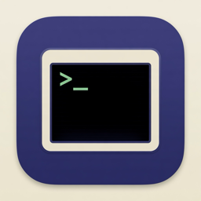

<p align="center">
  
</p>

<h1 align="center">MoshCatty</h1>

<p align="center">
  <strong>Pure Rust Mosh client — cross-platform, wire-compatible, no Cygwin</strong><br/>
  Built for <a href="https://github.com/binaricat/Netcatty"><strong>Netcatty</strong></a> · usable anywhere
</p>

<p align="center">
  <a href="https://github.com/binaricat/MoshCatty/actions/workflows/ci.yml"></a>
  &nbsp;
  <a href="https://github.com/binaricat/MoshCatty/releases/latest"></a>
  &nbsp;
  <a href="LICENSE"></a>
</p>

<p align="center">
  <a href="https://github.com/binaricat/MoshCatty/releases/latest">
    
  </a>
</p>

---

## What is MoshCatty?

**MoshCatty** is a pure Rust implementation of a [Mosh](https://mosh.org) **client**.

It speaks the real Mosh wire protocol (AES-128-OCB3, SSP, fragments, HostBytes paint) against stock `mosh-server` on Linux/macOS/Windows — **without** Cygwin, terminfo databases, or DLL bags.

It is the default path Netcatty uses to ship a reliable multi-platform Mosh client (especially on Windows, where classical Cygwin glue breaks).

```text
  SSH bootstrap (Netcatty / your tool)
           │
           ▼  MOSH CONNECT <port> <key>
  ┌────────────────────┐
  │   mosh-client      │  ← MoshCatty binary
  │  pure Rust · UDP   │
  └─────────┬──────────┘
            │  AES-OCB · SSP · HostBytes
            ▼
     remote mosh-server (stock)
```

---

## Why

| Approach | Windows reality |
|----------|-----------------|
| Cygwin `mosh-client` + partial DLLs | Cursor-only / terminfo / PTY sandwich failures |
| FluentTerminal old PE | Stale provenance, encoding issues |
| **MoshCatty** | One static-ish binary, same protocol stack everywhere |

Peer products either skip Windows Mosh or own a private engine. MoshCatty is the open, Netcatty-aligned engine.

---

## Features

- **Wire-compatible** with stock `mosh-server` 1.4.x (protocol v2)
- **Cross-platform**: Linux / macOS / Windows (no Cygwin runtime)
- **Drop-in CLI**: `MOSH_KEY=<key> mosh-client <host> <port>`
- **Library API** (`moshcatty` crate) for embedders
- **RFC 7253** AES-128-OCB3 + mosh-go interop vectors in CI
- **Netcatty-ready**: fits existing SSH bootstrap + node-pty swap

---

## Install

### From GitHub Releases

Download the archive for your platform from the [latest release](https://github.com/binaricat/MoshCatty/releases/latest):

| Asset | Platform |
|-------|----------|
| `mosh-client-linux-x64.tar.gz` | Linux x86_64 |
| `mosh-client-linux-arm64.tar.gz` | Linux aarch64 |
| `mosh-client-darwin-universal.tar.gz` | macOS universal |
| `mosh-client-win32-x64.tar.gz` | Windows x64 |

```sh
# Example: Linux x64
tar -xzf mosh-client-linux-x64.tar.gz
chmod +x mosh-client
MOSH_KEY=... ./mosh-client 203.0.113.10 60001
```

### From source

```sh
git clone https://github.com/binaricat/MoshCatty.git
cd MoshCatty
cargo build --release
# binary: target/release/mosh-client
```

Requires **Rust 1.75+**.

---

## Usage

MoshCatty is the **network client only**. You (or Netcatty) still run SSH to start `mosh-server` and obtain:

```text
MOSH CONNECT <udp-port> <base64-key>
```

Then:

```sh
export MOSH_KEY='xxxxxxxxxxxxxxxxxxxxxx'
mosh-client 192.0.2.10 60001
```

### Environment

| Variable | Meaning |
|----------|---------|
| `MOSH_KEY` | **Required.** Session key from `MOSH CONNECT` |
| `COLUMNS` / `LINES` | Initial / fallback terminal size |
| (Unix) live winsize | Polled via `TIOCGWINSZ` |
| (Windows) console size | Polled via `GetConsoleScreenBufferInfo` |

### Windows / ConPTY (Netcatty, node-pty)

Under ConPTY, Ctrl+C raises a Windows `CTRL_C_EVENT` in addition to the `\x03`
byte on stdin. MoshCatty installs a console control handler that **ignores**
`CTRL_C` / `CTRL_BREAK` as process-kill signals, and clears cooked console input
flags analogous to Unix `cfmakeraw` (ISIG off). Result: Ctrl+C interrupts the
*remote* shell instead of exiting the client with `STATUS_CONTROL_C_EXIT`.

---

## Architecture

```text
crypto ──► fragment ──► pb ──► transport (SSP) ──► terminal ──► client
  OCB3       1214B      TI/Host/User   zlib+ack      HostBytes    UDP session
```

| Module | Role |
|--------|------|
| `crypto` | AES-128-OCB3, mosh datagram seal/open |
| `fragment` | Instruction fragmentation (upstream layout) |
| `pb` | Hand-rolled protobuf codecs (field-compatible) |
| `transport` | SSP state numbers, throwaway, RTO, OOO crypto seq |
| `terminal` | Apply HostBytes paint stream |
| `client` | Dial, keys, resize, keepalive, network death |

---

## Development

```sh
cargo test
cargo build --release
cargo clippy --all-targets -- -D warnings   # when available
```

Tests include RFC 7253 empty-AAD vectors, mosh-go interop vectors, fragment OOO reassembly, SSP bidirectional rounds, and a fake-server client path.

---

## Releases & Netcatty integration

CI builds multi-platform `mosh-client` archives and publishes GitHub Releases with tags:

```text
moshcatty-0.1.0
```

[Netcatty](https://github.com/binaricat/Netcatty) pulls those assets the same way it previously used `Netcatty-mosh-bin`:

```text
MOSH_BIN_OWNER=binaricat
MOSH_BIN_REPO=MoshCatty
MOSH_BIN_RELEASE=moshcatty-0.1.0   # or resolve latest moshcatty-*
npm run fetch:mosh
```

Artifact names stay Netcatty-compatible:

```text
mosh-client-linux-x64.tar.gz
mosh-client-linux-arm64.tar.gz
mosh-client-darwin-universal.tar.gz
mosh-client-win32-x64.tar.gz
SHA256SUMS
```

---

## License

**GPL-3.0-or-later** — same family as [Mosh](https://github.com/mobile-shell/mosh) and [Netcatty](https://github.com/binaricat/Netcatty).

Protocol references: Mosh paper / upstream field numbers; interop vectors from [mosh-go](https://github.com/unixshells/mosh-go) (MIT). No AGPL code is vendored.

---

<p align="center">
  Made with 🐱 for the Netcatty ecosystem
</p>
